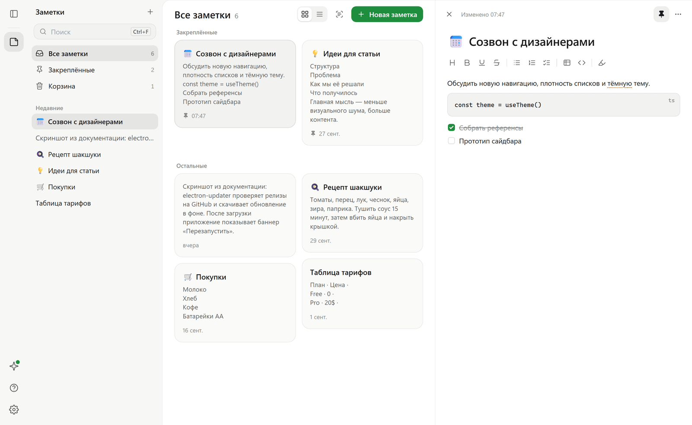
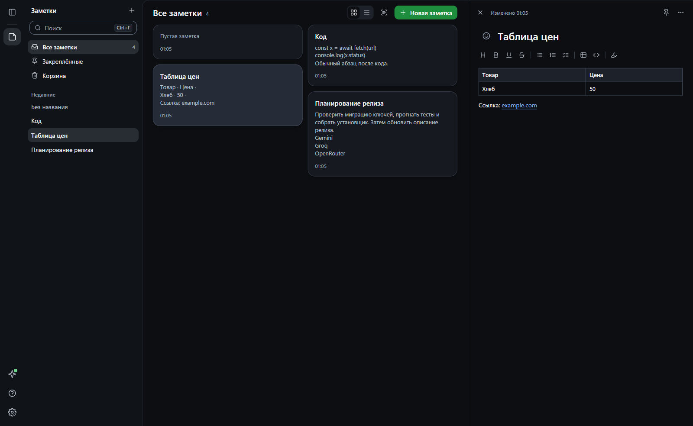
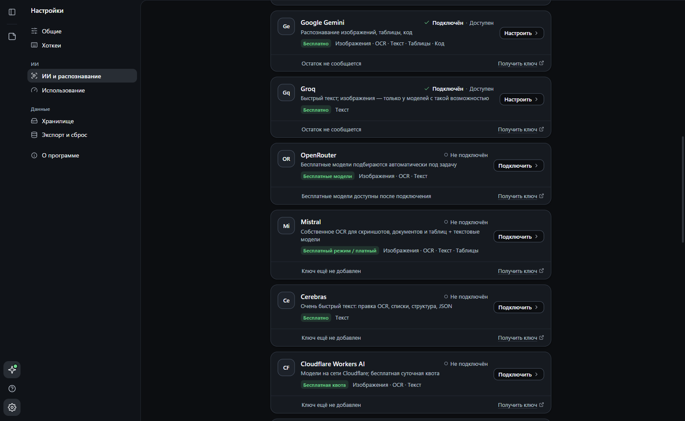

  

<h1 align="center">Snap Notes</h1>

  Заметки для Windows, которые забирают текст прямо с экрана. 
  Выделите область хоткеем — текст распознается и встанет в заметку вместе со списками, таблицами и кодом.

  <a href="https://github.com/eropermakov/snap-notes/releases/latest/download/Snap-Notes-Setup.exe"><b>⬇&nbsp;&nbsp;Скачать для Windows</b></a>
  &nbsp;·&nbsp;
  <a href="https://github.com/eropermakov/snap-notes/releases/latest">Что нового</a>

  
  
  

  

## Установка

1. **Скачайте** [`Snap-Notes-Setup.exe`](https://github.com/eropermakov/snap-notes/releases/latest/download/Snap-Notes-Setup.exe) — это всегда последняя версия, около 110 МБ.
2. **Запустите установщик.** Windows может показать окно «Система Windows защитила ваш компьютер». Нажмите **«Подробнее» → «Выполнить в любом случае»**. Так Windows реагирует на программы без платной цифровой подписи; установщик собран из кода этого репозитория.
3. **Пройдите короткую настройку** при первом запуске: источник распознавания, тема, хоткеи, автозапуск. Всё это можно поменять позже.

Обновления приходят сами: приложение проверяет их в фоне и предлагает перезапуститься. Проверить вручную — «Настройки → О программе».

## Как пользоваться

Хоткеи работают из любой программы, даже когда Snap Notes свёрнут в трей.

| Действие | Клавиши |
|---|---|
| Захват в заметку — текст добавится в конец, в порядке захватов | <kbd>Ctrl</kbd>+<kbd>Shift</kbd>+<kbd>S</kbd> |
| Захват в новую заметку — с фото и коротким названием | <kbd>Ctrl</kbd>+<kbd>Shift</kbd>+<kbd>D</kbd> |
| Прокручиваемый захват — длинная страница целиком | <kbd>Ctrl</kbd>+<kbd>Shift</kbd>+<kbd>L</kbd>, прокрутить, ещё раз |
| Сессия — несколько фрагментов подряд в одну заметку | <kbd>Ctrl</kbd>+<kbd>Alt</kbd>+<kbd>S</kbd> |
| Весь экран | <kbd>Ctrl</kbd>+<kbd>Shift</kbd>+<kbd>F</kbd> |
| Скопировать заметку для ChatGPT или Claude | <kbd>Ctrl</kbd>+<kbd>Alt</kbd>+<kbd>C</kbd> |
| Открыть Snap Notes | <kbd>Ctrl</kbd>+<kbd>Alt</kbd>+<kbd>N</kbd> |
| Быстрая заметка — маленькое окно поверх любой программы | <kbd>Ctrl</kbd>+<kbd>Alt</kbd>+<kbd>Q</kbd> |
| Повторить последний захват — та же область без выделения | <kbd>Ctrl</kbd>+<kbd>Alt</kbd>+<kbd>R</kbd> |
| Распознать картинку из буфера обмена | <kbd>Ctrl</kbd>+<kbd>Alt</kbd>+<kbd>O</kbd> |
| Поиск по заметкам | <kbd>Ctrl</kbd>+<kbd>Alt</kbd>+<kbd>K</kbd> |

Внутри приложения: <kbd>Ctrl</kbd>+<kbd>K</kbd> — найти любую заметку или действие, <kbd>Ctrl</kbd>+<kbd>N</kbd> — новая заметка, <kbd>Ctrl</kbd>+<kbd>F</kbd> — поиск, <kbd>Ctrl</kbd>+<kbd>Shift</kbd>+<kbd>V</kbd> — вставить как обычный текст. Закрепление, избранное, цвет, теги, дублирование и экспорт — по правому клику на заметке; несколько заметок выбираются <kbd>Ctrl</kbd>/<kbd>Shift</kbd>+клик. Все хоткеи меняются в настройках.

## Что умеет

- **Подстраивает рабочее место.** Редактор можно двигать внутри приложения за ручку над заметкой и возвращать вправо. Новые фрагменты плавно прокручиваются в поле зрения, если вы читаете конец заметки.
- **Даёт выбрать шрифт.** В «Настройки → Редактор» — 12 встроенных шрифтов с кириллицей, включая Montserrat, Manrope и Inter; доступны без интернета.

- **Сохраняет структуру.** Заголовки, списки, таблицы и блоки кода остаются собой, а не превращаются в сплошной текст. Сомнительные места подчёркнуты.
- **Помнит, откуда текст.** К каждому фрагменту сохраняется исходный скриншот — его можно открыть и сверить.
- **Работает без интернета.** Встроенный Tesseract распознаёт текст прямо на компьютере (языковые данные скачиваются один раз при первом распознавании). ИИ подключается по желанию и даёт лучшее качество.
- **Экспорт и копирование.** Word, PDF, Markdown, TXT; отдельная кнопка «Скопировать для AI».
- **Корзина, закреплённые заметки, тёмная тема, поиск.**

## Распознавание и ИИ

Snap Notes работает сразу после установки — локально и бесплатно. Если подключить ИИ, распознавание станет точнее, особенно для таблиц, кода и интерфейсов:

- **ChatGPT** — вход через свой аккаунт с планом ChatGPT, без API-ключа;
- **Gemini** — бесплатный ключ на [aistudio.google.com](https://aistudio.google.com/apikey);
- **Бесплатные и пробные тарифы:** Groq, OpenRouter (бесплатные модели подбираются автоматически), Mistral (своё OCR), Cerebras, Cloudflare Workers AI, NVIDIA NIM (для разработки и прототипов), Cohere (Trial), Hugging Face (бесплатные кредиты);
- **По своему ключу с оплатой:** OpenAI API, Anthropic API;
- **Для продвинутых:** свой OCR-эндпоинт на Modal — см. [integrations/modal](integrations/modal/README.md).

У каждого источника в настройках есть кнопка «Получить ключ» (официальная страница), проверка подключения, выбор модели и лимиты — только те, что сообщает сам провайдер. Если у одного источника кончился лимит, приложение само переходит к следующему: скриншот получают только источники, умеющие читать изображения, а текстовые модели работают после Tesseract. Режим «Только офлайн» гарантирует, что ни скриншоты, ни текст никуда не отправляются. Ключи хранятся зашифрованными средствами Windows.

  
  &nbsp;
  

## Частые вопросы

**Это бесплатно?** Да. Платить можно только самим ИИ-сервисам, если вы подключаете их по API-ключу.

**Где хранятся заметки?** Только на вашем компьютере, в `%APPDATA%\snap-notes`. Папку можно открыть из «Настройки → Экспорт и сброс».

**Хоткей не срабатывает.** Скорее всего, сочетание занято другой программой. Назначьте другое в «Настройки → Хоткеи» — приложение сразу скажет, если сочетание недоступно.

**Как удалить?** Через «Параметры Windows → Приложения», как любую программу.

Нашли ошибку или есть идея — [создайте issue](https://github.com/eropermakov/snap-notes/issues).

---

Для разработчиков: сборка, архитектура и выпуск версий — в [docs/DEVELOPMENT.md](docs/DEVELOPMENT.md).
